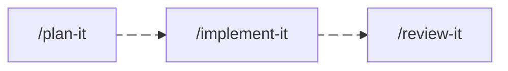
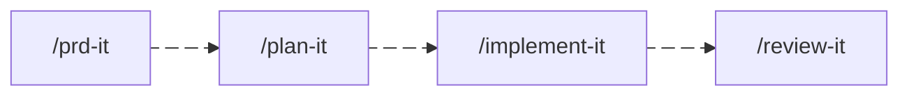
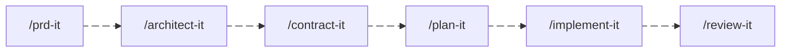
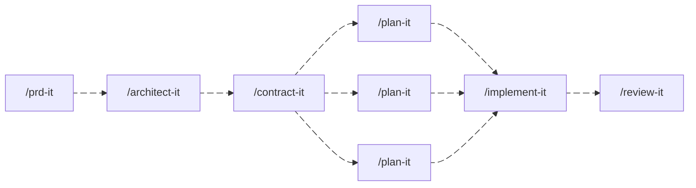

# Harness setup

## Installing skills

From an external repository:

```sh
npx skills add <owner/repo> --skill <skill-name>
```

## Skills

| Skill | Purpose | Output |
|---|---|---|
| `/prd-it` | Product requirements — what to build and why | `docs/prd/<slug>.md` |
| `/architect-it` | System structure — layers, ports, adapters, ADR stubs | `docs/architecture/<slug>.md` |
| `/contract-it` | Interface contracts — typed signatures, API schemas, event shapes | source stubs or `docs/contracts/<slug>.md` |
| `/plan-it` | Implementation tasks — sequenced, testable, self-contained | `tasks/issues/` |
| `/implement-it` | Code — TDD, vertical slices, project conventions | source files + `tasks/implementation/` |
| `/review-it` | Review implementation against task requirements | `tasks/reviews/` |
| `/commit-it` | Structured commit message and git commit | git commit |

Each skill is self-contained and usable on its own. Combine them based on the work at hand.

---

## Workflows

### Bug fix



No PRD or architecture needed. Write the task, fix it, verify it.

---

### Small feature on a known codebase


The codebase already has structure. Skip architecture when no new layers, ports, or boundaries are introduced.

---

### Feature with new behavior, no structural change



Capture what and why before writing tasks. Use when the problem is clear but the scope needs to be written down before implementation discussions begin.

---

### Feature that introduces new boundaries


Full workflow for features that add new ports, adapters, or integration points. Each skill produces an artifact the next one reads: PRD → architecture decisions → typed interfaces → implementation tasks.

---

### Greenfield project



Same as above. Both PRD and architecture are needed when starting from scratch with no prior codebase or domain model.

---

### Parallel team development



Define contracts before splitting work. Frontend and backend (or two backend teams) can develop in parallel once the shared interfaces are written and agreed on.

---

### Refactor (no new behavior)


No new boundaries. Plan what to refactor, implement it, and verify nothing regressed.

---

### API design spike

```
/contract-it
```

Use standalone to define or review interface contracts for an integration point — without a full architecture or planning phase. Useful when two teams need to agree on an API shape before either starts coding.

---

### Architecture review of existing code

```
/architect-it
```

Use standalone to document the architecture of an existing codebase, identify boundary violations, or create ADR stubs for undocumented decisions.

---

### Requirements clarification only

```
/prd-it
```

Use standalone when the problem space is unclear — before any technical discussion. Produces a structured brief that stakeholders can agree on before architecture or planning begins.

---

## Setup

0. Set up [AGENTS.md](AGENTS.md)
