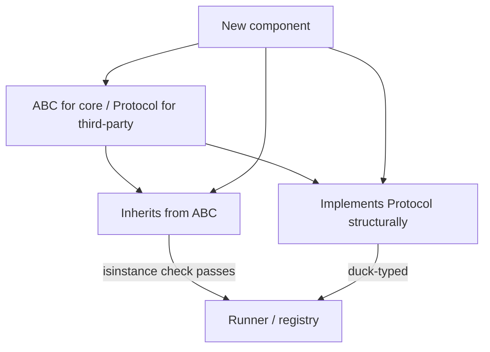

# ADR 002: Use abstract base classes for harness extension points

## Status

Accepted

## Date

2026-05-23

## Context

The benchmarks harness defines three primary extension points — `AgentAdapter`, `Evaluator`, and the soon-to-be-added `Tracker` — that must be polymorphically replaceable. `adapters/base.py` and `evaluators/base.py` already use Python ABCs (`abc.ABC`, `@abstractmethod`). `Tracker` currently has no interface, making it impossible to inject or swap. A consistent interface mechanism is needed before all four decoupling tasks can proceed.

The choice between ABCs (nominal subtyping) and Python Protocols (structural subtyping) is cross-cutting: it determines how every future extension point is defined, how third-party implementations register themselves, and how test fakes are written.

## Decision

Use Python abstract base classes (`abc.ABC`) for all harness extension points (`AgentAdapter`, `Evaluator`, `Tracker`, `WorkspaceManager`). New extension points must inherit from the matching abstract class and override all abstract methods.

## Options Considered

1. **ABCs for all extension points** — all `AgentAdapter`, `Evaluator`, `Tracker`, and `WorkspaceManager` are ABCs. `isinstance` checks work. IDE tooling highlights missing overrides at authoring time. `(recommended)`
2. **Python Protocols for all extension points** — structural subtyping; third parties implement without inheriting. No forced coupling to harness package. Harder to detect missing methods without running tests.
3. **ABCs for core, Protocols for third-party** — hybird model. Adds complexity: two interface mechanisms in one codebase, each with different semantics.

## Consequences

Positive:
- Consistent with the existing `adapters/base.py` and `evaluators/base.py` pattern — no migration required.
- `isinstance(impl, Tracker)` works reliably for registry type checks.
- IDEs (PyCharm, Pylance) show errors at authoring time when abstract methods are not overridden.
- Test fakes explicitly declare intent by inheriting the ABC — no silent duck-typing surprises.

Negative:
- Third-party implementors must import the harness package to inherit from the ABC — a nominal dependency.
- Renaming an abstract method requires updating all subclasses, not just call sites.

## Validation

- `isinstance(MLflowTracker(), Tracker)` returns `True` after Task 026.
- `isinstance(NullTracker(), Tracker)` returns `True` after Task 026.
- `isinstance(TempWorkspaceManager(), WorkspaceManager)` returns `True` after Task 028.
- All unit tests for registry resolution use `isinstance` checks to verify correctness.

## Open Questions

- Should ABCs expose a `__repr__` or `name` property to improve error messages in the registry? (Not required for current tasks — can be added later.)
