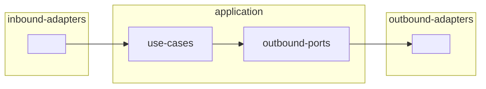

# Architecture: <name>

## Overview

<1–3 sentences: what this system does, for whom, and the key constraint or business rule that shapes the architecture.>

Example:
- An API that lets teams track project work items and invite collaborators. The main constraint is strict data isolation between teams — no team may read another team's projects or members.

## Scope

<full-project | bounded-context: <name> | feature-slice: <name>>

## Tech Stack

| Layer | Choice | Reason |
|---|---|---|
| Language | | |
| Framework | | |
| Persistence | | |
| Messaging | N/A — not required | |
| Auth | | |
| Observability | | |

Remove rows for layers not in scope. Do not add rows speculatively.

## Architecture Style

Hexagonal (Ports and Adapters)

<1–3 sentences: which boundary this architecture is most designed to protect — the domain boundary, the I/O boundary, or the external-service boundary — and why that boundary matters for this specific project.>

## Directory Structure

```
<paste canonical tree from references/architecture-rules.md, substituting actual entity and adapter names>
```

## Layer Responsibilities

| Layer | Owns | Must NOT contain |
|---|---|---|
| `domain/` | Entities, value objects, domain events | Framework imports, ORM models, HTTP types, DB queries |
| `application/use-cases/` | Use-case orchestration of domain + ports | Direct DB calls, HTTP types, cloud SDK calls |
| `application/ports/` | Port interfaces | Implementation code |
| `adapters/inbound/` | Entry-point translation (HTTP, CLI, events) | Business rules, direct DB calls |
| `adapters/outbound/` | Port implementations | Business rules, HTTP routing |
| `infrastructure/` | DI wiring, config, bootstrap | Business logic, adapter logic |

## Ports and Adapters Map

### Inbound (Driving) Adapters
> Translate external input into use-case calls. Adapters, not ports — inbound adapters call use cases directly.

| Adapter | Calls Use Case | Protocol |
|---|---|---|
| | | HTTP / CLI / Event / Queue |

Example:
| `HttpProjectController` | `CreateProjectUseCase`, `ListProjectsUseCase` | REST HTTP |

### Outbound (Driven) Ports and Adapters
> Interfaces the application depends on. Each port is an interface in `application/ports/outbound/`; each adapter is an implementation in `adapters/outbound/`.

| Port (Interface) | Adapter (Implementation) | Technology |
|---|---|---|
| | | PostgreSQL / MongoDB / HTTP / SQS |

Example:
| `ProjectRepository` | `PgProjectRepository` | PostgreSQL |
| `EmailPort` | `SendgridEmailAdapter` | Sendgrid HTTP API |

## Diagrams

### Hexagonal Layers



<!-- Add further diagrams only when the trigger conditions in references/diagram-selection.md are met. -->
<!-- Maximum 3 diagrams total. Maximum 10 nodes per diagram. -->

## Cross-Cutting Concerns

| Concern | Approach | Lives in |
|---|---|---|
| Authentication | | `adapters/inbound/http/middleware/` |
| Authorization | | `application/use-cases/` |
| Logging | Structured JSON | `infrastructure/` |
| Error handling | | `application/` |
| Config | | `infrastructure/config` |
| Tracing | | `infrastructure/` |

Remove rows for concerns not applicable to this project. Do not add speculative concerns.

## Open Decisions

> Each open decision needs an ADR stub in `docs/adrs/`. Threshold in [architecture-rules.md — ADR threshold](references/architecture-rules.md#adr-threshold).

- [ ] `docs/adrs/001-<slug>.md` — <one sentence: the decision to be made>

If no irreversible decisions exist: write `None — no hard-to-reverse or cross-cutting decisions identified.`

## Principles Applied

| Principle | How it manifests in this design |
|---|---|
| Single Responsibility | Each use case in `application/use-cases/` touches exactly one aggregate root |
| Open/Closed | New adapters plug into existing ports without changing application code |
| Dependency Inversion | `domain/` and `application/` import nothing from `adapters/` or `infrastructure/` |
| DRY | Shared domain logic lives in `domain/`; no duplicated validation across adapters |
| YAGNI | <list what was explicitly excluded and why — e.g., "No message queue: the PRD has no async processing requirement"> |
| KISS | <list the simplest structural choice made — e.g., "Single deployable; monorepo split deferred until team size forces it"> |
