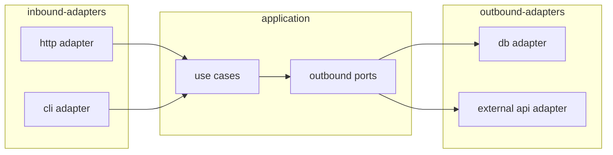

# Diagram Selection Rules for architect-it

Select the minimum set of diagrams that makes the architecture unambiguous.

## Mandatory diagram

Always include the **hexagonal layers flowchart**. It shows which adapters drive the application and which are driven by it. This is the primary diagram in every architecture document.

Limit to ≈10 nodes. Group adapters of the same type.

## Conditional diagrams

Add a diagram only when its trigger condition is met. One diagram per concern — do not repeat what the layers flowchart already shows.

| Diagram type | Trigger condition | Typical use |
|---|---|---|
| `sequenceDiagram` | A use case involves ≥2 external systems or async steps | Show message order for a key business flow |
| `erDiagram` | ≥3 domain entities with relationships | Show the data model |
| `classDiagram` | ≥3 domain objects with inheritance or composition | Show the object hierarchy |
| `stateDiagram-v2` | Any entity with ≥3 lifecycle states | Show state transitions |
| `flowchart` (pipeline) | Data pipeline or ML pipeline with ≥3 stages | Show stage order and branching |
| `flowchart` (deployment) | Microservices or cloud topology with ≥3 services | Show deployment boundaries |

## Project type defaults

| Project type | Mandatory | Conditional |
|---|---|---|
| `backend-api` | layers flowchart | `sequenceDiagram` for key use case; `erDiagram` if ≥3 entities |
| `frontend-spa` | layers flowchart | `sequenceDiagram` for data fetch flow if ≥2 async calls |
| `fullstack` | layers flowchart (one per app) | `sequenceDiagram` for client→api→db flow |
| `data-pipeline` | layers flowchart | `flowchart` (pipeline stages) |
| `data-science` | layers flowchart | `flowchart` (training pipeline); `classDiagram` for feature definitions |
| `cli` | layers flowchart | `sequenceDiagram` if ≥2 external resources accessed |
| `library` | layers flowchart | `classDiagram` for public API surface |

## Hard limits

- Maximum **3 diagrams** per architecture document. If you need more, the scope is too broad — split into multiple documents.
- Maximum **10 nodes** per diagram. Group related nodes into subgraphs if needed.
- Do not draw a diagram that repeats what the directory tree already shows.
- Do not draw a diagram for a single-adapter, single-use-case system — prose is enough.

## Formatting

- Use `---\ntitle: <short description>\n---` inside the Mermaid block when supported.
- Use lowercase kebab-case node labels: `user-repo`, `order-service`, `payment-port`.
- Place the mandatory layers flowchart under a `### Hexagonal Layers` heading.
- Place each conditional diagram under a heading that names the concern: `### Data Model`, `### Key Sequence: <use case name>`, etc.
