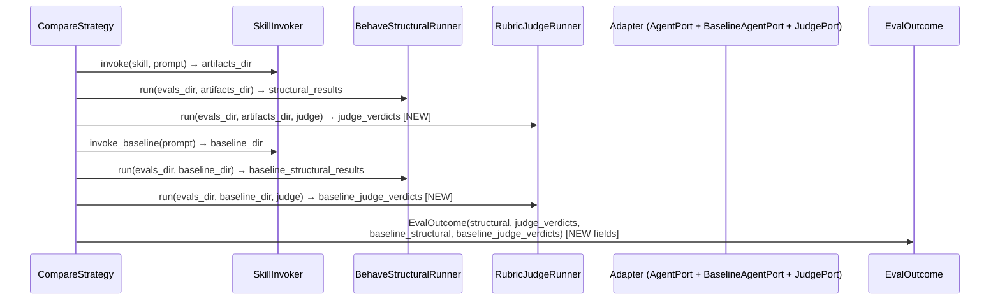

# Task: Add judge comparison to compare mode

## Priority

P0 — Core evaluation gap: compare mode only measures structural delta today, missing the rubric-quality dimension that is the most diagnostic signal for whether a skill improves agent output.

## Dependencies

- No task dependency; this is the first task in this plan.
- No ADR dependency; the change uses the existing `RubricJudgeRunner`, `JudgePort`, and `EvalOutcome` boundaries — no new architectural decisions.
- Requires `RubricJudgeRunner`, `JudgePort`, `BaselineAgentPort`, `EvalOutcome`, `MarkdownReportWriter`, and `CompareStrategy` as they exist in the current codebase.

## Assignability

**AFK** — all requirements and acceptance criteria are fully specified; no irreversible architectural decisions remain open; safe to delegate to an autonomous agent without mid-task review.

## Context

`CompareStrategy` runs the skill with SKILL.md injected and again without it (baseline), then runs `BehaveStructuralRunner` on both outputs to show a structural delta. However, it never runs `RubricJudgeRunner` on either output, so there is no per-rubric quality comparison. The judge phase (LLM-as-judge rubrics) is the most diagnostic signal — it measures chart-type justification, colorblind palette, dashboard story structure, etc. — but compare mode drops it entirely. The fix extends `CompareStrategy` to run the judge on both the skill artifacts and the baseline artifacts, stores the two verdict lists in `EvalOutcome`, and renders a per-rubric score-delta table in the markdown report.

Files to change:
- `runner/models.py` — add `baseline_judge_verdicts: list[JudgeReport]` to `EvalOutcome`
- `runner/strategies/compare.py` — add `judge_runner` + `judge` deps; call judge on both artifact dirs
- `runner/run.py` — inject `RubricJudgeRunner` and adapter as `JudgePort` into `CompareStrategy`
- `runner/reporting.py` — add `baseline_judge_verdicts` param to `write()`; add `_judge_comparison_lines` section
- `tests/strategies/test_compare.py` — cover new judge calls
- `tests/test_reporting.py` — cover new judge comparison section

## Use Cases

- **Feature**: Compare mode judge comparison
- **Scenario**: Evaluator runs compare mode on dataviz and reads whether the skill improves rubric scores
- **Given** the dataviz skill has rubrics covering colorblind palette, chart type justification, and dashboard structure
- **When** the evaluator runs `--mode compare --adapter opencode --skill dataviz`
- **Then** the report shows a per-rubric table with skill score, baseline score, and delta for each rubric
- **And** the evaluator can see whether the skill injected measurable quality improvement over plain Claude

---

- **Feature**: Compare mode judge comparison — no rubrics
- **Scenario**: Skill has no rubrics directory
- **Given** a skill with no `rubrics/` directory under `evals/`
- **When** compare mode runs
- **Then** the judge comparison section is omitted and structural comparison is unaffected

## Definition of Ready

- `RubricJudgeRunner.run(evals_dir, artifacts_dir, judge)` is callable with any `artifacts_dir` (confirmed — it already uses the passed `artifacts_dir` to resolve `_generated_artifacts_primary_`).
- `BaselineAgentPort.invoke_baseline` is implemented by both `ClaudeCodeAdapter` and `OpenCodeAdapter`.
- `EvalOutcome.baseline_structural_results` field already exists as the pattern to follow for the new `baseline_judge_verdicts` field.

## Functional Requirements

- `FR-001`: `CompareStrategy` must accept `judge_runner: RubricJudgeRunner` and `judge: JudgePort` as constructor parameters.
- `FR-002`: `CompareStrategy.run()` must call `RubricJudgeRunner.run` once with the skill artifacts directory and once with the baseline artifacts directory.
- `FR-003`: `EvalOutcome` must carry `baseline_judge_verdicts: list[JudgeReport]` alongside the existing `judge_verdicts` field.
- `FR-004`: `run.py` `_build_strategy` for `Mode.COMPARE` must inject `RubricJudgeRunner()` and the adapter cast as `JudgePort` into `CompareStrategy`.
- `FR-005`: `MarkdownReportWriter.write()` must accept and render `baseline_judge_verdicts` in a new `## Judge comparison` section.
- `FR-006`: The judge comparison section must show one row per rubric with: rubric ID, skill score, baseline score, and delta (skill − baseline, prefixed `+` when positive).
- `FR-007`: When `baseline_judge_verdicts` is empty or `None`, the judge comparison section must be omitted — same guard pattern as the existing structural comparison section.

## Non-Functional Requirements

- `NFR-001`: The judge comparison section in the report must use the same markdown table format as the existing `## LLM-as-judge checks` section for visual consistency.
- `NFR-002`: `CompareStrategy` must not break the existing `make check` quality gates (`mypy`, `ruff`, `deptry`, `vulture`, `import-linter`).

## Observability Requirements

- `OBS-001`: `RubricJudgeRunner` already emits `judge_start` and `judge_done` structured log events per rubric; these must appear for both the skill and baseline judge passes without modification.

## Acceptance Criteria

- `AC-001`: **Given** `CompareStrategy` is constructed with a `judge_runner` stub that returns two verdicts, **When** `run()` is called, **Then** `outcome.judge_verdicts` contains the skill verdicts and `outcome.baseline_judge_verdicts` contains the baseline verdicts.
- `AC-002`: **Given** `EvalOutcome` with both `judge_verdicts` and `baseline_judge_verdicts` populated, **When** `MarkdownReportWriter.write()` is called, **Then** the report file contains a `## Judge comparison` section with one row per rubric showing skill score, baseline score, and delta.
- `AC-003`: **Given** a skill with no `rubrics/` directory (empty `judge_verdicts` and `baseline_judge_verdicts`), **When** the report is written in compare mode, **Then** no `## Judge comparison` section appears in the output.
- `AC-004`: **Given** `run.py` builds a compare strategy with `--adapter opencode`, **When** `_build_strategy` executes, **Then** the returned `CompareStrategy` holds a `RubricJudgeRunner` instance and the adapter as `JudgePort` — verified by `make check` passing (type check confirms the wiring).
- `AC-005`: **Given** a rubric where skill score is 0.9 and baseline score is 0.6, **When** the report renders the judge comparison row, **Then** the delta column shows `+0.30`.

## Required Tests

### Unit Tests

- `UT-001`: `CompareStrategy.run()` calls `judge_runner.run` twice — once with the skill artifacts dir and once with the baseline artifacts dir. Covers `FR-002`.
- `UT-002`: `CompareStrategy.run()` returns `outcome.judge_verdicts` and `outcome.baseline_judge_verdicts` from the respective judge calls. Covers `FR-003`, `AC-001`.
- `UT-003`: `MarkdownReportWriter` renders a `## Judge comparison` section with correct delta values when both verdict lists are non-empty. Covers `FR-005`, `FR-006`, `AC-002`, `AC-005`.
- `UT-004`: `MarkdownReportWriter` omits the `## Judge comparison` section when `baseline_judge_verdicts` is empty. Covers `FR-007`, `AC-003`.
- `UT-005`: `CompareStrategy` with no judge verdicts returned still populates `outcome.structural_results` and `outcome.baseline_structural_results` correctly (no regression on existing behavior). Covers `NFR-002`.

### Integration Tests

Not applicable — all boundaries (`RubricJudgeRunner`, `JudgePort`, adapters) are already covered by existing tests; the new code paths are pure orchestration and report rendering, fully verifiable with unit tests using named fakes.

### Smoke Tests

Not applicable — `make check` (type check + lint + tests) covers the wiring; no deploy or startup scenario changed.

### End-to-End Tests

Not applicable — no user-facing CLI behavior changed; `--mode compare` already exists and the new output is an additive section in the report file.

### Regression Tests

Not applicable — no previously broken defect being fixed.

### Performance Tests

Not applicable — the judge calls are network-bound by design; no latency constraint is introduced by this task.

### Security Tests

Not applicable — no authentication, authorization, input handling, storage, secrets, or external communication boundaries touched.

### Usability Tests

Not applicable — output is a markdown report file; no interactive UI changed.

### Observability Tests

- `OT-001`: `RubricJudgeRunner` is called twice in compare mode and `judge_start` / `judge_done` log events appear for both the skill and baseline passes. Covers `OBS-001`.

## Definition of Done

- `CompareStrategy` accepts and uses `judge_runner` and `judge` deps.
- `EvalOutcome.baseline_judge_verdicts` field exists and is populated by `CompareStrategy.run()`.
- `run.py` wires `RubricJudgeRunner` and adapter as `JudgePort` into `CompareStrategy` for `Mode.COMPARE`.
- `MarkdownReportWriter` renders `## Judge comparison` with per-rubric skill score, baseline score, and delta.
- All required unit and observability tests pass under `make check`.
- `make check` passes with no new mypy, ruff, deptry, or vulture errors.
