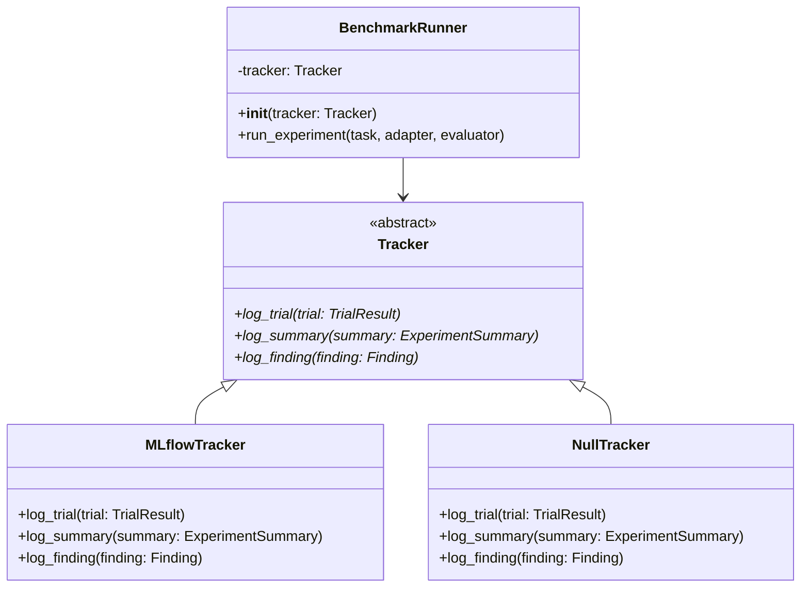

# Task: Define Tracker port and inject it into the runner

## Priority

P0 — foundational decoupling that unblocks all subsequent DI tasks; without it the runner cannot be tested in isolation and every downstream task is blocked.

## Dependencies

- Depends on ADR `docs/adrs/002-extension-point-interface-mechanism.md` being resolved to `Accepted` before implementation begins.
- No task predecessor; this is the first decoupling task.
- `harness/tracking/tracker.py` must be read to identify all `MLflowTracker` method signatures to mirror in the abstract base.
- `harness/runner.py` must be read to identify all `MLflowTracker` call sites to replace with injected tracker calls.

## Assignability

**HITL** — requires human approval of ADR `docs/adrs/002-extension-point-interface-mechanism.md` (ABC vs Protocol decision) before implementation can begin.

## Context

The benchmarks harness runner directly imports and instantiates `MLflowTracker` from `harness/tracking/tracker.py`. This makes it impossible to run experiments without a live MLflow server, prevents unit-testing runner orchestration logic in isolation, and blocks future tracking backend changes. This task introduces a `Tracker` ABC in `harness/tracking/base.py`, makes `MLflowTracker` inherit from it, adds a `NullTracker` no-op implementation for testing and dry runs, and refactors the runner to accept a `tracker: Tracker` as a constructor parameter. The CLI wires `MLflowTracker` by default and `NullTracker` when `--dry-run` is passed.

## Use Cases

- **Feature**: Swappable tracking backend
- **Scenario**: Developer runs an experiment without an MLflow server
  - **Given** the developer has no MLflow server running
  - **When** they invoke `bench-run --skill plan-it --platform claude-code --dry-run`
  - **Then** the experiment completes and results print to stdout
  - **And** no MLflow API call occurs
  - **And** stderr contains a warning that tracking is disabled

- **Scenario**: Test suite verifies runner orchestration in isolation
  - **Given** a unit test constructs `BenchmarkRunner(tracker=NullTracker())`
  - **When** the test calls `run_experiment()` with a fake adapter and evaluator
  - **Then** the experiment runs to completion without any MLflow side effects
  - **And** the returned `ExperimentSummary` is a correctly populated dataclass

## Definition of Ready

- ADR `docs/adrs/002-extension-point-interface-mechanism.md` is `Accepted`.
- `harness/tracking/tracker.py` has been read to identify all public method signatures.
- `harness/runner.py` has been read to identify all tracker call sites.
- `harness/models.py` has been read to confirm `TrialResult`, `ExperimentSummary`, and `Finding` type signatures.

## Functional Requirements

- `FR-001`: `harness/tracking/base.py` defines a `Tracker` ABC with abstract methods `log_trial(trial: TrialResult)`, `log_summary(summary: ExperimentSummary)`, and `log_finding(finding: Finding)` matching current `MLflowTracker` signatures.
- `FR-002`: `MLflowTracker` in `harness/tracking/tracker.py` inherits from `Tracker` and passes `isinstance(MLflowTracker(...), Tracker)`.
- `FR-003`: `NullTracker` in `harness/tracking/null_tracker.py` implements `Tracker` with no-op method bodies that silently discard all inputs and have no external side effects.
- `FR-004`: `NullTracker` has zero imports from `mlflow` or any external tracking library.
- `FR-005`: `BenchmarkRunner.__init__` accepts `tracker: Tracker` as a required parameter; no default value is provided.
- `FR-006`: `run.py` CLI wires `MLflowTracker()` as the tracker when invoked without `--dry-run`; wires `NullTracker()` when `--dry-run` is passed.
- `FR-007`: All existing MLflow tracking behavior is preserved when `MLflowTracker` is injected — no experiment data is lost.

## Non-Functional Requirements

- `NFR-001`: `NullTracker` introduces no imports beyond the Python standard library and `harness/models.py`.
- `NFR-002`: The refactoring changes no public CLI flags except adding `--dry-run`.
- `NFR-003`: `harness/tracking/base.py` is the only new public module introduced by this task.

## Observability Requirements

- `OBS-001`: When `NullTracker` is active, the runner logs exactly one warning to stderr: `[tracker] dry-run mode: experiment tracking is disabled`.
- `OBS-002`: `Tracker.log_trial` must not write raw agent output or workspace file contents to any log — these may contain secrets or sensitive task data.

## Acceptance Criteria

- `AC-001`: **Given** `MLflowTracker` after this task, **When** `isinstance(mlflow_tracker, Tracker)` is evaluated, **Then** it returns `True`.
- `AC-002`: **Given** a `NullTracker` instance, **When** `log_trial()`, `log_summary()`, and `log_finding()` are called with valid inputs, **Then** no exception is raised and no MLflow call occurs.
- `AC-003`: **Given** `BenchmarkRunner(tracker=NullTracker())` with a fake adapter and evaluator, **When** `run_experiment()` is called with one task, **Then** an `ExperimentSummary` is returned and no MLflow API is called.
- `AC-004`: **Given** `bench-run --dry-run`, **When** invoked, **Then** stderr contains `[tracker] dry-run mode: experiment tracking is disabled` and the experiment completes.
- `AC-005`: **Given** `bench-run` without `--dry-run`, **When** invoked, **Then** `MLflowTracker` is used and all existing tracking behavior is unchanged.

## Required Tests

### Unit Tests

- `UT-001`: `NullTracker().log_trial(trial)` with a fully populated `TrialResult` returns without raising. Covers `FR-003`, `AC-002`.
- `UT-002`: `NullTracker().log_summary(summary)` with a fully populated `ExperimentSummary` returns without raising. Covers `FR-003`.
- `UT-003`: `NullTracker().log_finding(finding)` with a `Finding` returns without raising. Covers `FR-003`.
- `UT-004`: `isinstance(MLflowTracker(...), Tracker)` returns `True`. Covers `FR-002`, `AC-001`.
- `UT-005`: `NullTracker` module has no `mlflow` import (checked by inspecting `null_tracker.__spec__` or module source). Covers `FR-004`.

### Integration Tests

- `IT-001`: **Scenario**: Runner returns a summary when given a `NullTracker`
  - **Given** `BenchmarkRunner(tracker=NullTracker())` with a `FakeAdapter` that returns a deterministic `TrialResult` and a `FakeEvaluator`
  - **When** `run_experiment(task)` is called
  - **Then** an `ExperimentSummary` is returned with the correct task ID
  - **And** no MLflow API is called
  Covers `FR-005`, `AC-003`.

### Smoke Tests

Not applicable — no deploy or startup boundary changes; the CLI gains one flag but the command still starts as before.

### End-to-End Tests

Not applicable — no user-visible output changes except the `--dry-run` warning on stderr.

### Regression Tests

Not applicable — no known previous defect related to tracker coupling.

### Performance Tests

Not applicable — interface indirection adds negligible overhead to experiment orchestration.

### Security Tests

Not applicable — no authentication, authorization, input-handling, or trust-boundary changes.

### Usability Tests

Not applicable — no user-facing UI changes.

### Observability Tests

- `OT-001`: **Given** `bench-run --dry-run` is executed, **When** the command runs, **Then** stderr contains exactly the string `[tracker] dry-run mode: experiment tracking is disabled`. Covers `OBS-001`.

## Definition of Done

- `harness/tracking/base.py` defines `Tracker` ABC with all required abstract methods.
- `harness/tracking/null_tracker.py` defines `NullTracker` with no mlflow dependency.
- `MLflowTracker` inherits `Tracker` and all tests pass.
- `BenchmarkRunner` accepts `tracker: Tracker` as a constructor parameter.
- `run.py` wires `MLflowTracker` by default and `NullTracker` with `--dry-run`.
- All existing tests pass without modification.
- ADR `docs/adrs/002-extension-point-interface-mechanism.md` is updated to `Accepted`.
