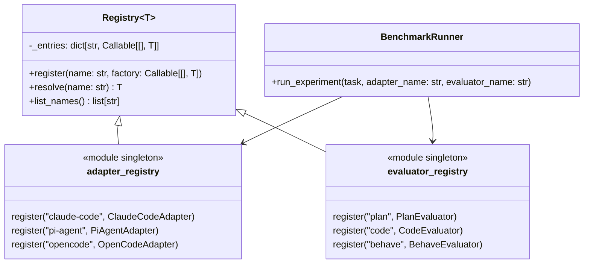

# Task: Introduce component registry for adapters and evaluators

## Priority

P1 — eliminates the runner's hardcoded knowledge of concrete adapter and evaluator names; required before new platforms or evaluators can be added without modifying runner internals.

## Dependencies

- Depends on Task 026 (`tasks/issues/026-define-tracker-port-and-inject-into-runner.md`) being complete — the DI pattern established there must be in place before the registry follows the same approach.
- Depends on ADR `docs/adrs/002-extension-point-interface-mechanism.md` being `Accepted` — registry type checks use `isinstance` against ABCs.
- `harness/runner.py` must be read to identify all adapter/evaluator name→class mappings to migrate into the registry.

## Assignability

**AFK** — all requirements and acceptance criteria are fully resolved; no irreversible architectural decisions remain open after ADR 002 is accepted.

## Context

`runner.py` currently resolves adapter and evaluator implementations by mapping string names (e.g., `"claude-code"`, `"plan_evaluator"`) to concrete classes via if-elif chains or inline dicts. Adding a new adapter or evaluator requires modifying the runner. This task extracts resolution into a `Registry[T]` class in `harness/registry.py`, pre-registers all built-in components at import time in their respective `__init__.py` files, and rewires the runner to use the registry. Third parties can register custom components by calling `adapter_registry.register()` before invoking the runner — no runner modification needed.

## Use Cases

- **Feature**: Pluggable adapter registration
- **Scenario**: Developer adds a new platform adapter without modifying the runner
  - **Given** a developer creates `GeminiAdapter(AgentAdapter)`
  - **When** they call `adapter_registry.register("gemini", GeminiAdapter)` before invoking the runner
  - **Then** `bench-run --platform gemini` resolves and runs `GeminiAdapter` with no change to `runner.py`

- **Scenario**: Runner fails fast on unknown component name
  - **Given** the runner is invoked with `--platform unknown-platform`
  - **When** the registry attempts to resolve `"unknown-platform"`
  - **Then** a `KeyError` is raised immediately with the message listing all known adapter names

## Definition of Ready

- Task 026 is complete (`BenchmarkRunner` accepts injected tracker; DI pattern is established).
- ADR `docs/adrs/002-extension-point-interface-mechanism.md` is `Accepted`.
- `runner.py` has been read to identify the exact if-elif or dict structure mapping adapter/evaluator names to classes.

## Functional Requirements

- `FR-001`: `harness/registry.py` defines a generic `Registry[T]` class with `register(name: str, factory: Callable[[], T])`, `resolve(name: str) -> T`, and `list_names() -> list[str]` methods.
- `FR-002`: `harness/registry.py` exports two module-level singletons: `adapter_registry: Registry[AgentAdapter]` and `evaluator_registry: Registry[Evaluator]`.
- `FR-003`: Built-in adapters (`claude-code`, `pi-agent`, `opencode`) are registered in `harness/adapters/__init__.py` by calling `adapter_registry.register(...)` on import.
- `FR-004`: Built-in evaluators (`plan`, `code`, `behave`) are registered in `harness/evaluators/__init__.py` by calling `evaluator_registry.register(...)` on import.
- `FR-005`: `runner.py` resolves adapters and evaluators exclusively through the registry — all direct class imports for resolution purposes are removed from the runner.
- `FR-006`: `registry.resolve(unknown_name)` raises `KeyError` whose message lists all currently registered names.
- `FR-007`: `harness/registry.py` imports only `typing` and `harness/adapters/base.py` / `harness/evaluators/base.py` — no concrete adapter or evaluator classes are imported inside `registry.py` itself.

## Non-Functional Requirements

- `NFR-001`: `Registry.resolve()` is O(1) — backed by a `dict`, not a linear scan.
- `NFR-002`: Importing `harness.registry` does not transitively import MLflow, subprocess, or any platform CLI dependency.
- `NFR-003`: Registering the same name twice raises `ValueError` to prevent silent overwrites.

## Observability Requirements

- `OBS-001`: Not applicable — the registry is a pure in-memory lookup; no log, metric, or trace instrumentation is required.

## Acceptance Criteria

- `AC-001`: **Given** `adapter_registry` after import, **When** `adapter_registry.resolve("claude-code")` is called, **Then** a `ClaudeCodeAdapter` instance is returned.
- `AC-002`: **Given** `adapter_registry`, **When** `adapter_registry.resolve("unknown")` is called, **Then** `KeyError` is raised and the error message contains `"claude-code"`, `"pi-agent"`, and `"opencode"`.
- `AC-003`: **Given** a custom `GeminiAdapter(AgentAdapter)`, **When** `adapter_registry.register("gemini", GeminiAdapter)` is called and then `adapter_registry.resolve("gemini")`, **Then** a `GeminiAdapter` instance is returned.
- `AC-004`: **Given** `adapter_registry.register("x", SomeClass)` called twice, **When** the second call executes, **Then** `ValueError` is raised.
- `AC-005`: **Given** `runner.py` after this task, **When** grepped for hardcoded adapter class names (`ClaudeCodeAdapter`, `PiAgentAdapter`, `OpenCodeAdapter`) in resolution logic, **Then** no such imports or references exist in the runner's resolution path.

## Required Tests

### Unit Tests

- `UT-001`: `Registry.register()` then `resolve()` returns the factory's output. Covers `FR-001`, `AC-001`.
- `UT-002`: `Registry.resolve("unknown")` raises `KeyError` containing all registered names. Covers `FR-006`, `AC-002`.
- `UT-003`: `Registry.list_names()` returns all registered names in a consistent order. Covers `FR-001`.
- `UT-004`: `Registry.register("x", ...)` called twice raises `ValueError`. Covers `NFR-003`, `AC-004`.
- `UT-005`: `adapter_registry.resolve("claude-code")` returns an instance of `ClaudeCodeAdapter`. Covers `FR-003`, `AC-001`.
- `UT-006`: `evaluator_registry.resolve("plan")` returns an instance of `PlanEvaluator`. Covers `FR-004`.

### Integration Tests

- `IT-001`: **Scenario**: `evaluator_registry` is consulted by runner per task evaluator name
  - **Given** `BenchmarkRunner` with a patched `evaluator_registry`
  - **When** `run_experiment()` is called with a task whose `evaluator` field is `"plan"`
  - **Then** `evaluator_registry.resolve("plan")` and `evaluator_registry.resolve("behave")` are called
  - **And** no hardcoded evaluator class reference exists inside the runner
  Covers `FR-005`, `AC-005`.

### Smoke Tests

Not applicable — registry is a pure in-memory module; no deployment or startup boundary is involved.

### End-to-End Tests

Not applicable — no user-visible CLI output changes.

### Regression Tests

Not applicable — no known previous defect.

### Performance Tests

Not applicable — O(1) dict lookup has no measurable overhead at experiment scale.

### Security Tests

Not applicable — registry is an internal in-memory lookup with no external input or trust boundary.

### Usability Tests

Not applicable — `KeyError` message clarity is verified by `AC-002`.

### Observability Tests

Not applicable — no log or metric changes.

## Definition of Done

- `harness/registry.py` exists with `Registry[T]`, `adapter_registry`, and `evaluator_registry`.
- All built-in adapters and evaluators are registered on import from their `__init__.py`.
- `runner.py` resolves all components through the registry with no hardcoded class references in the resolution path.
- `NFR-002` verified: importing `harness.registry` does not pull in MLflow or subprocess.
- All existing tests pass.
