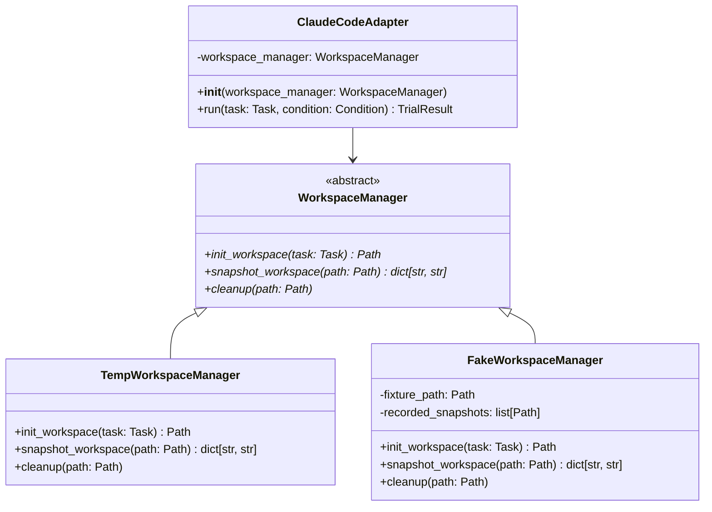

# Task: Formalize workspace isolation as an injectable concern in adapters

## Priority

P1 — enables adapter unit testing without real filesystem or subprocess calls; required before adapter logic (output parsing, token counting, retry behavior) can be tested in isolation.

## Dependencies

- Depends on Task 026 (`tasks/issues/026-define-tracker-port-and-inject-into-runner.md`) being complete — the constructor-injection pattern must be established before adapters adopt it.
- Depends on ADR `docs/adrs/002-extension-point-interface-mechanism.md` being `Accepted` — `WorkspaceManager` follows the same ABC pattern.
- `harness/adapters/_workspace.py` must be read to identify `init_workspace()` and `snapshot_workspace()` function signatures.
- `harness/adapters/claude_code.py`, `pi_agent.py`, and `opencode.py` must be read to identify all `_workspace` call sites.

## Assignability

**AFK** — all requirements and acceptance criteria are fully resolved; no irreversible architectural decisions remain open after ADR 002 is accepted.

## Context

Each adapter (`ClaudeCodeAdapter`, `PiAgentAdapter`, `OpenCodeAdapter`) directly calls `init_workspace()` and `snapshot_workspace()` from `harness/adapters/_workspace.py` inside its `run()` method. These calls create real temporary directories, run `git init`, and scan the filesystem — making adapter logic untestable without a live environment. This task defines a `WorkspaceManager` ABC in `harness/adapters/workspace.py`, wraps `_workspace.py`'s functions into a `TempWorkspaceManager` concrete class, introduces a `FakeWorkspaceManager` for tests, and refactors all three adapters to accept `workspace_manager: WorkspaceManager` as a constructor parameter defaulting to `TempWorkspaceManager()`.

## Use Cases

- **Feature**: Adapter unit testing without real filesystem
- **Scenario**: Test verifies adapter output-parsing logic
  - **Given** `ClaudeCodeAdapter(workspace_manager=FakeWorkspaceManager(fixture_dir))` with subprocess mocked
  - **When** the test calls `adapter.run(task, Condition.WITH_SKILL)`
  - **Then** the adapter processes output using the fixture directory
  - **And** no real temp directory is created or git subprocess is called

- **Scenario**: Production run uses real temp workspace
  - **Given** `ClaudeCodeAdapter()` constructed with no explicit `workspace_manager`
  - **When** `adapter.run()` is called in a real experiment
  - **Then** `TempWorkspaceManager` creates a real temp dir, initializes git, captures the snapshot, and cleans up — behavior is unchanged

## Definition of Ready

- Task 026 is complete (constructor-injection pattern established).
- ADR `docs/adrs/002-extension-point-interface-mechanism.md` is `Accepted`.
- `harness/adapters/_workspace.py` has been read to identify `init_workspace()` and `snapshot_workspace()` signatures.
- `harness/adapters/claude_code.py`, `pi_agent.py`, and `opencode.py` have been read to map all `_workspace` call sites.

## Functional Requirements

- `FR-001`: `harness/adapters/workspace.py` defines `WorkspaceManager` ABC with abstract methods `init_workspace(task: Task) -> Path`, `snapshot_workspace(path: Path) -> dict[str, str]`, and `cleanup(path: Path) -> None`.
- `FR-002`: `TempWorkspaceManager` in `harness/adapters/workspace.py` wraps the existing `_workspace.py` functions; `_workspace.py` is kept but used only by `TempWorkspaceManager`.
- `FR-003`: `FakeWorkspaceManager` in `tests/fakes/fake_workspace_manager.py` returns a caller-supplied `fixture_path` from `init_workspace()`, records each path passed to `snapshot_workspace()` in `recorded_snapshots`, returns a caller-supplied `snapshot_data` dict, and is a no-op for `cleanup()`.
- `FR-004`: `FakeWorkspaceManager` has no imports from `subprocess`, `tempfile`, or any git tooling.
- `FR-005`: All three adapters (`ClaudeCodeAdapter`, `PiAgentAdapter`, `OpenCodeAdapter`) accept `workspace_manager: WorkspaceManager = TempWorkspaceManager()` as a constructor parameter.
- `FR-006`: All adapter `run()` methods delegate workspace operations exclusively through `self.workspace_manager` — no direct calls to `_workspace.py` functions remain inside adapter `run()` bodies.
- `FR-007`: Existing production behavior is unchanged when adapters are constructed with default arguments.

## Non-Functional Requirements

- `NFR-001`: `FakeWorkspaceManager` has zero production dependencies — no mlflow, no subprocess, no tempfile.
- `NFR-002`: Adapters must not create real temp directories or run git subprocess calls when `FakeWorkspaceManager` is injected.

## Observability Requirements

- `OBS-001`: Not applicable — workspace management is an infrastructure detail; existing logging inside `_workspace.py` is unchanged and still active when `TempWorkspaceManager` is used.

## Acceptance Criteria

- `AC-001`: **Given** `ClaudeCodeAdapter(workspace_manager=FakeWorkspaceManager(fixture_path, {}))` with subprocess mocked, **When** `adapter.run(task, Condition.WITH_SKILL)` is called, **Then** no real directory is created and `FakeWorkspaceManager.recorded_snapshots` contains one entry.
- `AC-002`: **Given** `FakeWorkspaceManager(fixture_path, snapshot_data)`, **When** `snapshot_workspace(any_path)` is called, **Then** `any_path` is appended to `recorded_snapshots` and `snapshot_data` is returned.
- `AC-003`: **Given** `ClaudeCodeAdapter()` (default args) in a real environment, **When** `adapter.run()` is called, **Then** production behavior is unchanged — a real temp dir is created and cleaned up.
- `AC-004`: **Given** `isinstance(TempWorkspaceManager(), WorkspaceManager)`, **When** evaluated, **Then** returns `True`.
- `AC-005`: **Given** `runner.py` adapter `run()` methods after this task, **When** grepped for direct `_workspace` imports, **Then** no such import exists in any adapter `run()` body.

## Required Tests

### Unit Tests

- `UT-001`: `FakeWorkspaceManager.init_workspace(task)` returns `fixture_path` without creating any real directory. Covers `FR-003`, `AC-001`.
- `UT-002`: `FakeWorkspaceManager.snapshot_workspace(some_path)` appends `some_path` to `recorded_snapshots` and returns `snapshot_data`. Covers `FR-003`, `AC-002`.
- `UT-003`: `FakeWorkspaceManager.cleanup(path)` is a no-op and raises no exception. Covers `FR-003`.
- `UT-004`: `isinstance(TempWorkspaceManager(), WorkspaceManager)` returns `True`. Covers `FR-002`, `AC-004`.
- `UT-005`: `ClaudeCodeAdapter()` without explicit `workspace_manager` has `self.workspace_manager` set to a `TempWorkspaceManager` instance. Covers `FR-005`.

### Integration Tests

- `IT-001`: **Scenario**: Adapter delegates workspace lifecycle to `FakeWorkspaceManager`
  - **Given** `ClaudeCodeAdapter(workspace_manager=FakeWorkspaceManager(fixture_path, {}))` with subprocess mocked to return deterministic stdout
  - **When** `adapter.run(task, Condition.WITH_SKILL)` is called
  - **Then** `FakeWorkspaceManager.init_workspace()` is called once
  - **And** `FakeWorkspaceManager.snapshot_workspace()` is called once
  - **And** `FakeWorkspaceManager.cleanup()` is called once
  Covers `FR-006`, `AC-001`.

### Smoke Tests

Not applicable — no deploy or startup boundary; adapters default to `TempWorkspaceManager` and existing behavior is unchanged.

### End-to-End Tests

Not applicable — no user-visible CLI behavior change.

### Regression Tests

Not applicable — no known previous defect.

### Performance Tests

Not applicable — workspace delegation adds no measurable overhead.

### Security Tests

Not applicable — no authentication, authorization, input-handling, or trust-boundary changes.

### Usability Tests

Not applicable — no user-facing behavior change.

### Observability Tests

Not applicable — workspace logging inside `_workspace.py` is unchanged.

## Definition of Done

- `harness/adapters/workspace.py` defines `WorkspaceManager` ABC and `TempWorkspaceManager`.
- `tests/fakes/fake_workspace_manager.py` defines `FakeWorkspaceManager` with no production dependencies.
- All three adapters accept injected `WorkspaceManager` with `TempWorkspaceManager` as default.
- No direct `_workspace.py` function calls remain inside any adapter `run()` body.
- All existing tests pass.
- `UT-001` through `UT-005` and `IT-001` pass.
