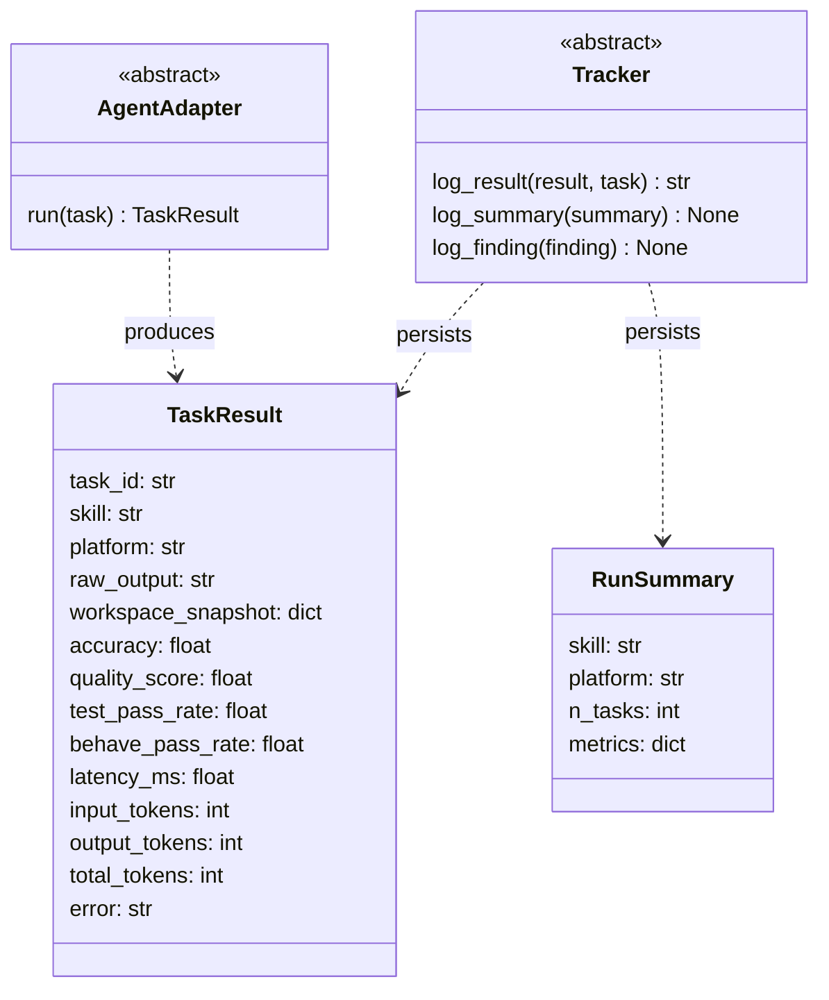

# Task: Replace trial-centric model types with TaskResult and RunSummary

## Priority

P0 — All other tasks in this batch (036, 037, 038) depend on the new types. This is a pure rename/simplification of the model layer with no new behavior added.

## Dependencies

- Depends on ADR `docs/adrs/003-drop-paired-experiment-model.md`.
- No task dependency; can start immediately once the ADR is accepted.

## Assignability

**AFK** — All renames and field removals are fully specified below. No open architecture decisions remain.

## Context

The harness models were built for a paired experiment design (Condition enum, N trials, Wilcoxon statistics). ADR 003 abandons that design. This task implements the model-layer consequences: rename and simplify the core data types so the rest of the harness works against a single-execution model.

## Use Cases

- **Feature**: Benchmark evaluation
- **Scenario**: Developer runs a benchmark for a skill
- **Given** a skill and a task corpus
- **When** the runner executes each task once
- **Then** each execution produces a `TaskResult` with metrics, and the run produces a `RunSummary` aggregating them

## Definition of Ready

- ADR `docs/adrs/003-drop-paired-experiment-model.md` is accepted.
- All 3 adapter implementations (`claude_code.py`, `opencode.py`, `pi_agent.py`) are identified for signature update.
- All test files referencing `TrialResult`, `ExperimentSummary`, or `Condition` are identified.

## Functional Requirements

- `FR-001`: `TrialResult` is renamed to `TaskResult`; fields `condition: str` and `trial_index: int` are removed.
- `FR-002`: `ExperimentSummary` is renamed to `RunSummary`; fields `without_skill`, `p_values`, `effect_sizes`, `trial_stats`, and `n_trials` are removed; field `with_skill` is renamed to `metrics`.
- `FR-003`: `Condition` enum is deleted from `models.py`.
- `FR-004`: `analysis.py` (TrialStats, analyze_trials, Wilcoxon, Cohen's d) is deleted.
- `FR-005`: `AgentAdapter.run(task, condition, trial_index)` becomes `run(task) -> TaskResult`.
- `FR-006`: `Tracker.log_trial(result, task, ...)` becomes `log_result(result, task, ...) -> str`; `log_summary` accepts `RunSummary`.
- `FR-007`: All 3 adapter implementations and both tracker implementations (`NullTracker`, `MLflowTracker`) are updated to the new types.
- `FR-008`: `test_analysis.py` is deleted (module no longer exists). All other tests referencing removed types are updated to use the new types.

## Non-Functional Requirements

- `NFR-001`: No new logic is added. Every change is a rename, field removal, or signature update.
- `NFR-002`: The `FakeWorkspaceManager` test double and `WorkspaceManager` ABC are unchanged.
- `NFR-003`: Tests must not reference `Condition`, `TrialResult`, `ExperimentSummary`, `trial_index`, or `condition` after this task.

## Observability Requirements

- `OBS-001`: `MLflowTracker.log_result()` run name changes from `{task_id}__{condition}__trial{trial_index}` to `{task_id}`.
- `OBS-002`: `MLflowTracker.log_summary()` drops `without_skill__*`, `p_value__*`, and `effect_size__*` metric keys; writes `metrics__*` keys from `RunSummary.metrics`.

## Acceptance Criteria

- `AC-001`: **Given** the updated `models.py`, **When** `TaskResult` is instantiated without `condition` or `trial_index`, **Then** it constructs without error and `total_tokens` returns `input_tokens + output_tokens`.
- `AC-002`: **Given** the updated `models.py`, **When** `RunSummary` is instantiated with `metrics={"accuracy": (0.9, 0.1)}`, **Then** `summary.metrics["accuracy"]` returns `(0.9, 0.1)`.
- `AC-003`: **Given** the updated adapters, **When** `adapter.run(task)` is called (no `condition`, no `trial_index`), **Then** it returns a `TaskResult`.
- `AC-004`: **Given** `NullTracker`, **When** `log_result(result, task)` is called, **Then** it returns `""` without raising.
- `AC-005`: **Given** `MLflowTracker`, **When** `log_result` is called, **Then** the MLflow run name is `{task_id}` (no condition or trial suffix).
- `AC-006`: **Given** the test suite, **When** all tests run, **Then** zero references to `TrialResult`, `ExperimentSummary`, `Condition`, `trial_index`, or `condition` remain in test files.

## Required Tests

### Unit Tests

- `UT-001`: `TaskResult.total_tokens` returns `input_tokens + output_tokens`. Covers `FR-001`.
- `UT-002`: `RunSummary` field access: `skill`, `platform`, `n_tasks`, `metrics` all present; `without_skill`, `p_values`, `trial_stats` absent. Covers `FR-002`.
- `UT-003`: `GoldStandard` default fields (`required_sections=[]`, `required_findings=[]`, etc.) are unchanged. Covers `NFR-001`.

### Integration Tests

- `IT-001`: **Scenario**: Adapter run produces TaskResult  
  **Given** a `ClaudeCodeAdapter` with a `FakeWorkspaceManager` and mocked `subprocess.run`  
  **When** `adapter.run(task)` is called with no `condition` or `trial_index`  
  **Then** the return value is a `TaskResult` with `task_id`, `skill`, `platform`, `latency_ms > 0`, and `error == ""`  
  Covers `FR-005`, `AC-003`.

- `IT-002`: **Scenario**: NullTracker log_result does not raise  
  **Given** a `NullTracker` and a `TaskResult`  
  **When** `tracker.log_result(result, task)` is called  
  **Then** it returns `""` and writes the dry-run warning to stderr  
  Covers `FR-006`, `AC-004`.

### Smoke Tests

Not applicable — no deploy or startup path changed.

### End-to-End Tests

Not applicable — no user-facing behavior changed.

### Regression Tests

Not applicable — no previously broken defect being fixed.

### Performance Tests

Not applicable — no performance-sensitive path changed.

### Security Tests

Not applicable — no auth, input handling, or trust boundary changed.

### Usability Tests

Not applicable — no user-facing output changed in this task (CLI is updated in task 038).

### Observability Tests

- `OT-001`: **Given** a mocked MLflow, **When** `MLflowTracker.log_result` is called, **Then** the MLflow run name equals `task_id` with no condition or trial suffix. Covers `OBS-001`.

## Definition of Done

- `models.py`: `TaskResult`, `RunSummary`, `Task`, `GoldStandard`, `Platform`, `Finding` present; `TrialResult`, `ExperimentSummary`, `Condition` absent.
- `analysis.py` deleted.
- All 3 adapters: `run(task) -> TaskResult` (no `condition`, no `trial_index`).
- `tracking/base.py`: `log_result` method signature; `log_summary` accepts `RunSummary`.
- `NullTracker` and `MLflowTracker` implement updated `Tracker` contract.
- `test_analysis.py` deleted.
- All remaining test files compile and pass with no reference to removed types.
