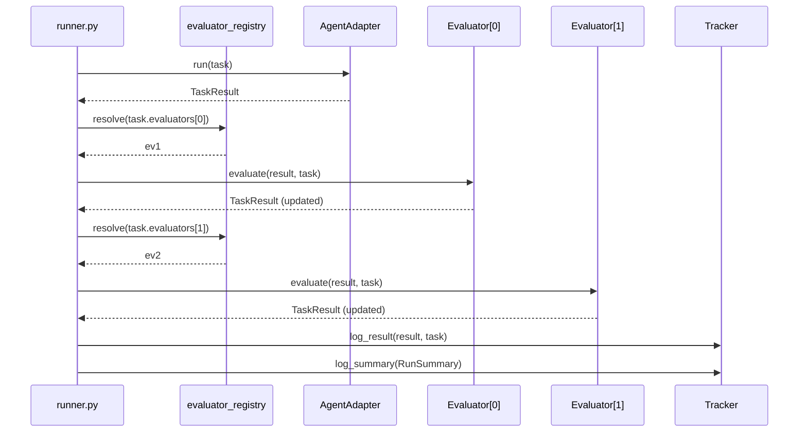

# Task: Single-execution runner with task-declared evaluator pipeline

## Priority

P0 — This is the core token-cost reduction. Task 038 (CLI alignment) depends on this.

## Dependencies

- Depends on Task 035: `TaskResult` and `RunSummary` types must exist.
- Depends on ADR `docs/adrs/003-drop-paired-experiment-model.md`.

## Assignability

**AFK** — All changes are fully specified. The evaluator pipeline contract, corpus format change, and runner loop simplification leave no open decisions.

## Context

The runner has three problems this task fixes:

1. **N-trial loop with statistics.** The loop runs N×2 agent calls and feeds results into Wilcoxon. ADR 003 eliminates this — each task runs once.
2. **Hardcoded behave crosscutting concern.** `runner.py` unconditionally calls `evaluator_registry.resolve("behave")` on every result, regardless of whether the task's evaluator is behave-compatible. This couples the runner to a specific evaluator.
3. **`Task.evaluator` is a single string.** This forces the runner to hardcode multi-evaluator composition. Moving to `Task.evaluators: list[str]` lets each task declare its own pipeline.

After this task, the runner resolves and applies `task.evaluators` in sequence — behave is just another entry in the list, not a special case.

## Use Cases

- **Feature**: Skill benchmarking
- **Scenario**: Developer benchmarks plan-it with a new skill variant
- **Given** a task corpus where each task declares `evaluators: ["plan", "behave"]`
- **When** the runner executes each task once
- **Then** each TaskResult is scored by plan evaluator then behave evaluator in sequence, without any hardcoded evaluator calls in the runner

## Definition of Ready

- Task 035 is complete: `TaskResult`, `RunSummary`, updated adapter and tracker signatures exist.
- `evaluator_registry` is available for pipeline resolution.

## Functional Requirements

- `FR-001`: `runner.py` executes each task exactly once (no N-trial loop, no `n_trials` parameter).
- `FR-002`: The `WITHOUT_SKILL` condition branch and all `without_skill` aggregation are removed from the runner.
- `FR-003`: The hardcoded `behave_ev = evaluator_registry.resolve("behave")` crosscutting call is removed from the runner.
- `FR-004`: The runner applies `task.evaluators` in declaration order, resolving each from `evaluator_registry`.
- `FR-005`: `Task` gains an `evaluators: list[str]` field, parsed from the task JSON `"evaluators"` key; defaults to `[task.evaluator]` when the key is absent (backward compatibility for existing corpus files).
- `FR-006`: All 5 plan-it corpus JSON files (`tasks/plan-it/*.json`) and all implement-it corpus JSON files (`tasks/implement-it/*.json`) are updated to include an explicit `"evaluators"` array: plan tasks use `["plan", "behave"]`, implement tasks use `["code"]`.
- `FR-007`: `BenchmarkRunner.run_experiment()` removes parameters `n_trials`, `use_judge`, and `with_skill_only`. The `skill_dir` parameter is retained for variant comparisons.
- `FR-008`: `LLMJudge` is removed from the runner import and the core loop. The `harness/evaluators/llm_judge.py` module is retained as a standalone callable but not wired into the default pipeline.
- `FR-009`: `PlanEvaluator.evaluate()` stops computing `precision`, `recall`, and `f1` (treating extra sections as false positives was a category error for structural evaluation). It retains `accuracy` (fraction of required sections present) and `quality_score` (weighted composite).

## Non-Functional Requirements

- `NFR-001`: The runner must not import or reference `Condition`, `TrialStats`, or `analyze_trials`.
- `NFR-002`: Evaluator order in the pipeline matches the declaration order in `task.evaluators`; no implicit reordering.
- `NFR-003`: Adding a new evaluator to `evaluator_registry` must not require modifying the runner.

## Observability Requirements

Not applicable — no new telemetry introduced; MLflow logging paths are updated in task 035.

## Acceptance Criteria

- `AC-001`: **Given** a task with `evaluators: ["plan", "behave"]`, **When** the runner executes it, **Then** `plan` evaluator is called before `behave` evaluator on the same `TaskResult`.
- `AC-002`: **Given** a task with `evaluators: ["code"]`, **When** the runner executes it, **Then** `behave` evaluator is NOT called (no crosscutting call).
- `AC-003`: **Given** a task JSON without an `"evaluators"` key, **When** `Task.from_dict` parses it, **Then** `task.evaluators` equals `[task.evaluator]`.
- `AC-004`: **Given** the updated runner, **When** `BenchmarkRunner.run_experiment()` is called, **Then** calling it with `n_trials`, `use_judge`, or `with_skill_only` raises `TypeError` (parameter removed).
- `AC-005`: **Given** `PlanEvaluator.evaluate()`, **When** evaluated on any output, **Then** `result.precision`, `result.recall`, and `result.f1` remain at `0.0` (not set by this evaluator).
- `AC-006`: **Given** a corpus task JSON for plan-it, **When** loaded, **Then** `task.evaluators == ["plan", "behave"]`.

## Required Tests

### Unit Tests

- `UT-001`: `Task.from_dict` with no `"evaluators"` key falls back to `[task.evaluator]`. Covers `FR-005`, `AC-003`.
- `UT-002`: `Task.from_dict` with explicit `"evaluators": ["plan", "behave"]` parses correctly. Covers `FR-005`.
- `UT-003`: `PlanEvaluator.evaluate()` leaves `precision`, `recall`, `f1` at `0.0`. Covers `FR-009`, `AC-005`.

### Integration Tests

- `IT-001`: **Scenario**: Runner applies evaluators in declared order  
  **Given** a fake adapter, a fake `plan` evaluator, and a fake `behave` evaluator registered in `evaluator_registry`  
  **When** the runner executes a task with `evaluators: ["plan", "behave"]`  
  **Then** `plan.evaluate` is called before `behave.evaluate` on the same `TaskResult`  
  Covers `FR-004`, `AC-001`.

- `IT-002`: **Scenario**: Runner skips behave for code-only evaluator list  
  **Given** a fake adapter and a fake `code` evaluator  
  **When** the runner executes a task with `evaluators: ["code"]`  
  **Then** `behave.evaluate` is never called  
  Covers `FR-003`, `AC-002`.

- `IT-003`: **Scenario**: BenchmarkRunner with NullTracker returns RunSummary  
  **Given** a `BenchmarkRunner` with `NullTracker`, a fake adapter, and a task corpus  
  **When** `run_experiment(adapter, skill, tasks_dir)` is called (no `n_trials`, no `with_skill_only`)  
  **Then** it returns a `RunSummary` with `n_tasks == 1`  
  Covers `FR-001`, `FR-007`.

### Smoke Tests

Not applicable — no deploy or startup path changed.

### End-to-End Tests

Not applicable — no complete user journey changed (CLI flags are updated in task 038).

### Regression Tests

Not applicable — no previously broken defect being fixed.

### Performance Tests

Not applicable — no measurable performance constraint specified.

### Security Tests

Not applicable — no auth or trust boundary changed.

### Usability Tests

Not applicable — no user-facing CLI output changed in this task (task 038 handles that).

### Observability Tests

Not applicable — no new telemetry introduced.

## Definition of Done

- `runner.py`: single-execution loop; `n_trials`, `use_judge`, `with_skill_only` removed; evaluator pipeline driven by `task.evaluators`.
- `models.py`: `Task.evaluators: list[str]` added; `Task.from_dict` handles missing key with backward-compatible default.
- All corpus JSON files in `tasks/plan-it/` include `"evaluators": ["plan", "behave"]`.
- All corpus JSON files in `tasks/implement-it/` include `"evaluators": ["code"]`.
- `PlanEvaluator`: `precision`, `recall`, `f1` fields not set.
- `LLMJudge` import removed from `runner.py`.
- `test_registry.py` IT-001 and `test_tracker.py` IT-001 updated to call runner without removed parameters.
- All tests pass.
